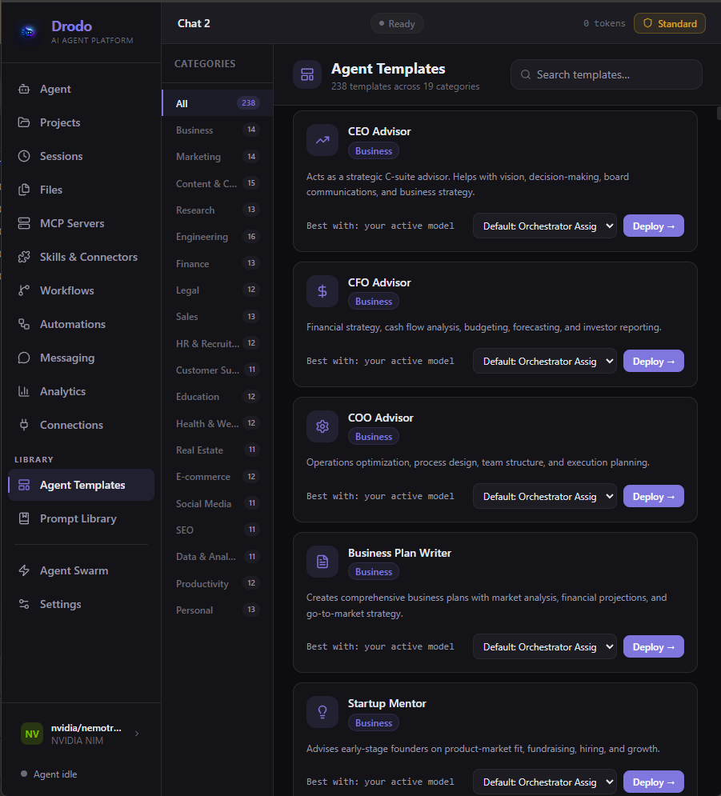
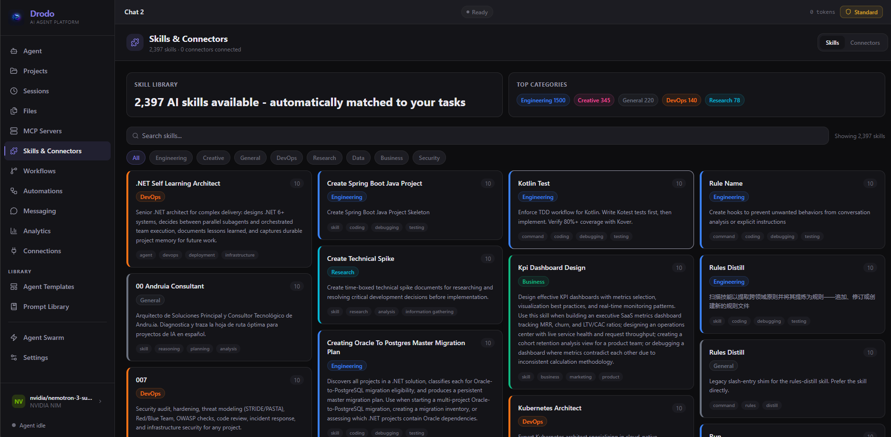
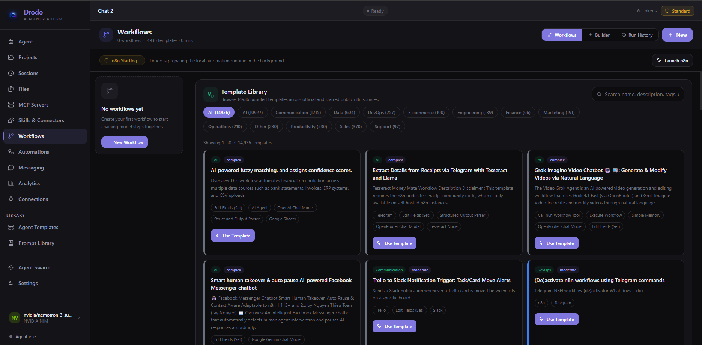
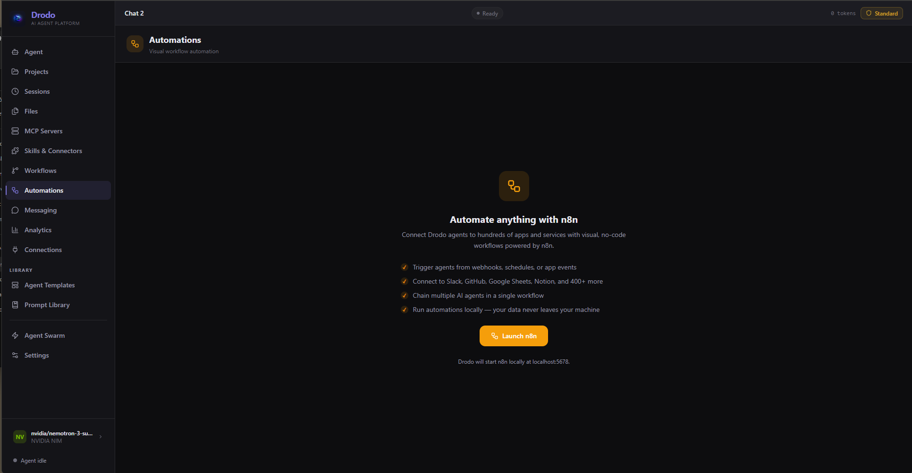
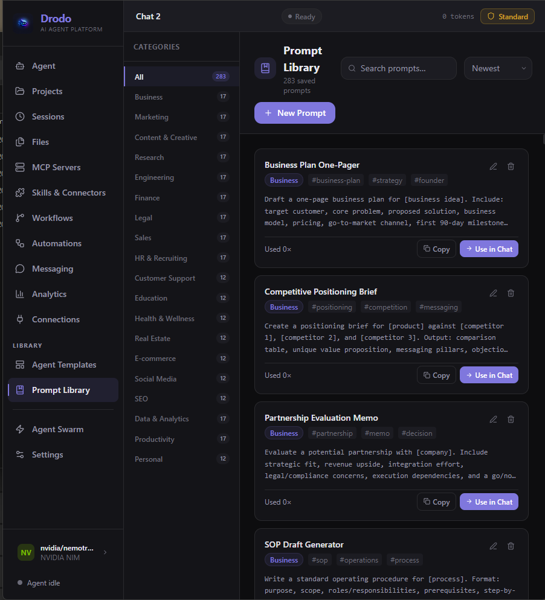
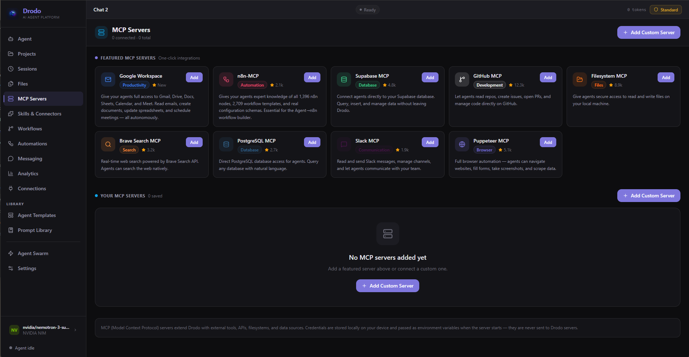
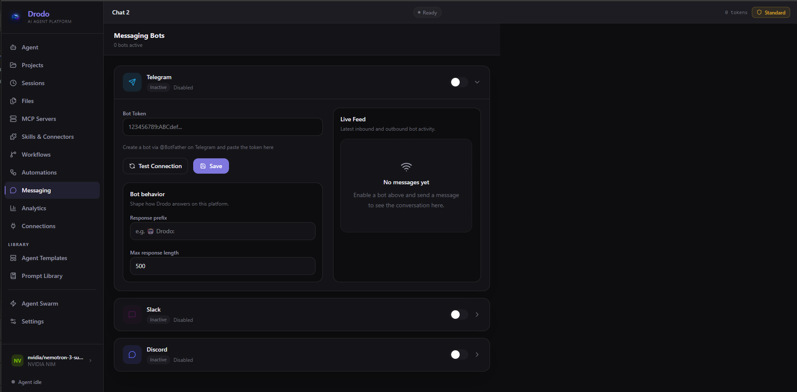
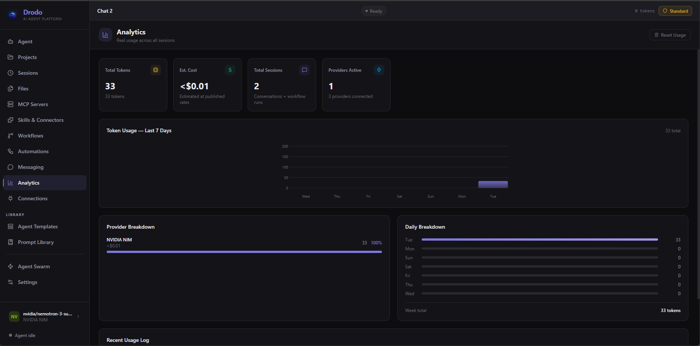
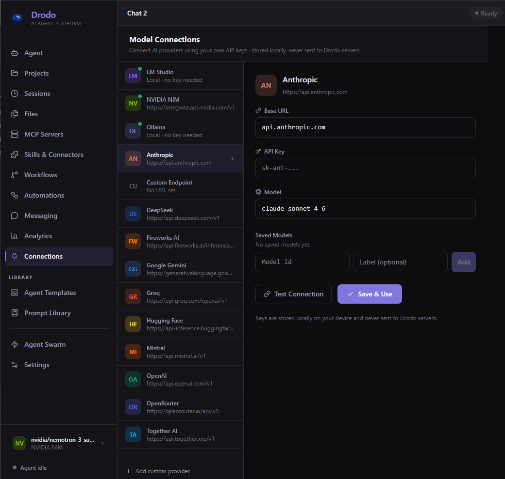
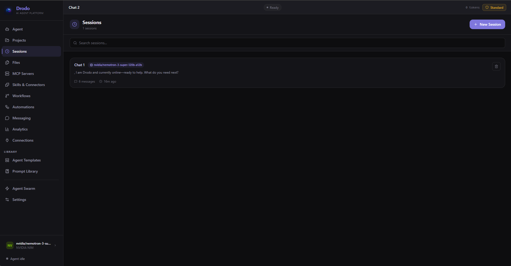

# Drodo

### The AI Agent Platform Built for Everyone

**Connect any AI model. Deploy autonomous agents. Automate anything.**
*No technical knowledge required. No subscriptions. No lock-in.*

---

## What is Drodo?

Drodo is the most powerful AI agent platform ever built for everyday people.

It combines autonomous multi-agent orchestration, 2,397 AI skills, 14,936 workflow templates, 238 one-click expert agents, a full-featured prompt library, real-time mission control, and a built-in n8n automation engine — all inside a single beautiful desktop app that installs in under 3 minutes.

You don't need to know how to code. You don't need to configure servers. You don't need a subscription. Install Drodo, connect any AI provider, and start doing things that used to require an entire engineering team.

> **Node.js, Git, and the n8n automation engine install automatically with Drodo — zero manual setup, zero command line, zero technical knowledge required.**

---

## Why Drodo?

| Feature | Drodo | ChatGPT | Claude.ai | OpenClaw | Agent Zero |
|---|---|---|---|---|---|
| Any AI model, bring your own key | ✅ | ❌ | ❌ | ✅ | ✅ |
| No subscription required | ✅ | ❌ | ❌ | ✅ | ✅ |
| One-click install, zero config | ✅ | ✅ | ✅ | ❌ | ❌ |
| Live multi-agent mission control | ✅ | ❌ | ❌ | ⚠️ | ⚠️ |
| Autonomous multi-agent swarm | ✅ | ❌ | ❌ | ⚠️ | ✅ |
| 14,936 built-in workflow templates | ✅ | ❌ | ❌ | ❌ | ❌ |
| 2,397 built-in AI skills | ✅ | ❌ | ❌ | ❌ | ❌ |
| 238 one-click expert agent templates | ✅ | ❌ | ❌ | ❌ | ❌ |
| n8n automation engine (auto-installed) | ✅ | ❌ | ❌ | ❌ | ❌ |
| Telegram / Slack / Discord bots | ✅ | ❌ | ❌ | ⚠️ | ❌ |
| Built-in analytics & token tracking | ✅ | ❌ | ❌ | ❌ | ❌ |
| Non-technical friendly | ✅ | ✅ | ✅ | ❌ | ❌ |
| Cloud sync | ✅ | ✅ | ✅ | ❌ | ❌ |

---

## Features

### 🤖 Autonomous Multi-Agent Orchestration

Give Drodo a goal. It handles the rest.

Drodo's Mixture-of-Experts orchestrator automatically decides whether to answer directly, dispatch a single specialist agent, or fan the task out across a full parallel swarm — based on what the task actually requires. Each agent gets a scoped mission, runs independently, and feeds its output back into the larger goal. You get a clean, observable chain of reasoning: one agent researches, another plans, another executes, another reviews.

Switch between Standard and Autonomous modes with one click. In Autonomous mode, agents self-continue until the task is complete — no babysitting required.

### 🎯 238 One-Click Expert Agent Templates

Launch a domain expert instantly — no prompt engineering required.

Drodo ships with 238 ready-to-deploy agent templates across 19 categories:

**Business · Marketing · Content & Creative · Research · Engineering · Finance · Legal · Sales · HR & Recruiting · Customer Support · Education · Health & Wellness · Real Estate · E-commerce · Social Media · SEO · Data & Analytics · Productivity · Personal**

From CEO Advisor to Security Auditor to Ghostwriter to Kubernetes Architect — every template is designed to deliver expert-level output from the very first message.

### 🧠 2,397 AI Skills — Automatically Injected

No toggles. No configuration. Skills are matched to every task automatically.

Drodo's skill engine analyzes each request and injects the right capabilities directly into the agent's working context. Skills span Engineering (1,500+), Creative (345), General (220), DevOps (140), Research (78), Business, Data, and Security — automatically selected based on what your task actually needs.

### ⚡ 14,936 Built-in Workflow Templates

The largest bundled automation library ever shipped in a desktop app.

Drodo includes 14,936 n8n workflow templates spanning AI (10,927), Communication (1,215), Data (604), DevOps (257), E-commerce (100), Engineering (139), Finance (66), Marketing (191), Operations (210), Productivity (530), Sales (370), and Support (97) — all available instantly, all searchable, all deployable with one click.

The n8n automation engine, Node.js, and Git install automatically alongside Drodo. No npm. No terminal. No system configuration needed.

### 📝 283 Ready-to-Use Prompts

A curated prompt library spanning every professional domain — organized, searchable, and deployable to any agent with a single click. Business plans, campaign briefs, code reviews, research memos, financial models, legal checklists, and much more — all built in and ready to use.

### 🔴 Live Mission Control — Agent Swarm

A real-time control room for autonomous work.

- Watch every active agent update live
- See tool calls and execution progress as they happen
- Inspect per-agent status, summaries, and timing
- Track the entire swarm from a global feed
- Spawn unlimited subagents for parallel task execution
- Abort individual runs the moment something goes wrong

Most AI tools hide the work. Drodo makes it fully visible.

### 🔌 One-Click MCP Integrations

Connect agents to the real world with structured, secure tool access — no configuration required:

**Google Workspace · n8n-MCP · Supabase · GitHub · Filesystem · Brave Search · PostgreSQL · Slack · Puppeteer**

Or add any custom MCP server with a URL. Credentials are stored locally on your device and never sent to Drodo servers.

### 📱 Messaging Bot Integration

Control your agents from anywhere. Connect Telegram, Slack, or Discord and route any incoming message through your active AI provider — with streamed responses delivered directly back to the same conversation. Your agents are accessible from your phone, your team workspace, or a Discord server.

### 📊 Analytics & Token Tracking

Full visibility into your AI usage — total tokens, estimated cost, sessions, provider breakdown, and a 7-day usage chart. Know exactly what you're spending and where, across every provider and every session.

### 🌐 Model Agnostic — Every Provider, Your Keys

Never locked to a single vendor. Never charged a subscription.

Connect any provider, use any model, switch anytime. Your API keys are stored locally on your device and never sent to Drodo servers.

**OpenAI · Anthropic · Google Gemini · NVIDIA NIM · OpenRouter · Mistral · Groq · Together AI · Fireworks AI · DeepSeek · Hugging Face · Ollama · LM Studio · Any custom OpenAI-compatible endpoint**

### ☁️ Cloud Sync

Optional Supabase-backed sync for sessions, workflows, and your prompt library across devices. Works fully offline in guest mode. Your keys and data stay yours — nothing is routed through Drodo servers.

---

## Getting Started

### Installation

1. Download the latest installer from the button above or from [Releases](https://github.com/Drodo44/Drodo.io/releases/latest)
2. Run the installer and follow the guided setup wizard
3. Drodo automatically installs Node.js, Git, and the n8n automation engine — no manual steps required
4. Connect your first AI model with your own API key
5. Deploy your first agent

> **Windows SmartScreen:** Windows may show a security prompt on first run. Click **"More info" → "Run anyway"**. This is expected for new applications and will be resolved with code signing, which is on the roadmap.

### System Requirements

- Windows 10 or later (64-bit) · Linux x86_64
- 4 GB RAM minimum (8 GB recommended for agent swarms)
- Internet connection for AI model API calls
- ~2 GB disk space for the automation runtime (installed automatically to your chosen drive)

---

## Tech Stack

| Layer | Technology |
|---|---|
| Desktop Framework | Tauri 2 |
| Frontend | React + TypeScript + Vite |
| Styling | Tailwind CSS |
| State Management | Zustand |
| Backend / Auth | Supabase |
| Automation Engine | n8n (bundled, auto-installed) |
| AI Streaming | Custom multi-provider streaming engine |
| UI Components | Radix UI + Lucide React |

---

## Supported AI Providers

| Provider | Example Models |
|---|---|
| Anthropic | claude-sonnet-4-6, claude-opus-4-6 |
| OpenAI | gpt-4o, o3 |
| Google Gemini | gemini-2.0-flash, gemini-2.5-pro |
| NVIDIA NIM | meta/llama-3.1-70b-instruct |
| OpenRouter | Any model via openrouter.ai |
| Mistral | mistral-large-latest |
| Groq | llama-3.3-70b-versatile |
| Together AI | meta-llama/Llama-3-8b-chat-hf |
| Fireworks AI | llama-v3-8b-instruct |
| DeepSeek | deepseek-chat |
| Hugging Face | Any inference-compatible model |
| Ollama | Any locally running model |
| LM Studio | Any locally running model |
| Custom Endpoint | Any OpenAI-compatible base URL |

---

## Roadmap

- [x] Automated cross-platform CI — Windows (.exe) and Linux (.AppImage) on every release
- [x] Autonomous multi-agent swarm with live mission control
- [x] 14,936 bundled n8n workflow templates
- [x] 2,397 AI skills with automatic task matching
- [x] 238 one-click expert agent templates
- [x] 283 built-in prompts across every domain
- [x] Automated runtime installation (Node, Git, n8n — zero manual setup)
- [x] Messaging bot integration (Telegram, Slack, Discord)
- [x] Analytics & token usage dashboard
- [x] Cloud sync via Supabase
- [x] One-click MCP server integrations
- [ ] Code signing (removes Windows SmartScreen warning)
- [ ] macOS build
- [ ] Mobile companion app
- [ ] Pro tier with advanced features
- [ ] More messaging platforms (WhatsApp, Google Chat, Teams)
- [ ] Marketplace for user-created agent templates and skills

---

## Download

| Platform | Download |
|---|---|
| 🪟 Windows (x64) | [**⬇ Download Latest Installer**](https://github.com/Drodo44/Drodo.io/releases/latest) |
| 🐧 Linux (AppImage) | [**⬇ Download Latest AppImage**](https://github.com/Drodo44/Drodo.io/releases/latest) |
| 🍎 macOS | Coming soon |

[View all releases and release notes →](https://github.com/Drodo44/Drodo.io/releases)

[☕ Support Drodo on Buy Me a Coffee](https://buymeacoffee.com/Drodo)

---

## License

Licensed under the [Business Source License 1.1](LICENSE). Personal and non-commercial use is permitted. Commercial use requires written permission from the author.
